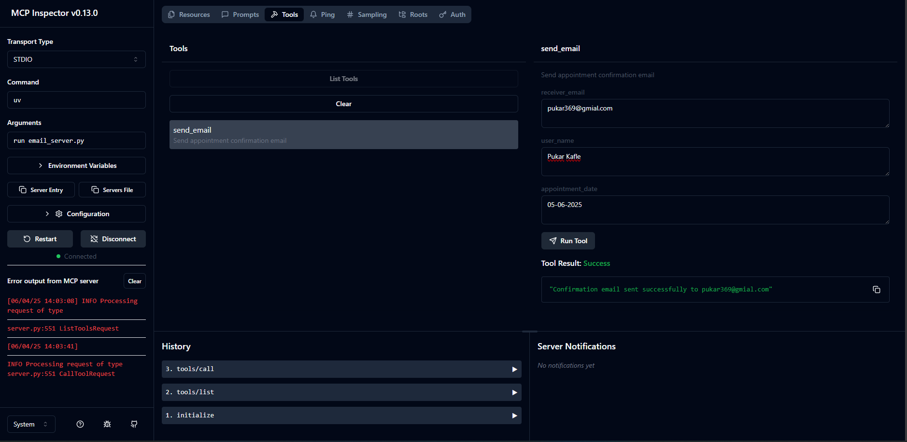

# 🤖 NeuralFlow AI Assistant

A CLI-based AI chatbot that handles company knowledge queries and appointment booking with automatic email confirmations.

## What It Does

- **Answers company questions** using RAG (document search)
- **Books appointments** and saves them to database
- **Sends confirmation emails** automatically
- **Natural conversation** powered by Claude 3.5 Sonnet

> **Note:** NeuralFlow Technology is a fictional company created for this demo. All company documents are made-up examples. You can add as many real or fictional company documents as needed to the `neuralflow_docs/` folder.

---

## Quick Setup

### 1. Project Initialization

```bash
# Create new project
uv init neuralflow-ai-assistant
cd neuralflow-ai-assistant

# Create virtual environment
uv venv

# Activate virtual environment
.venv\Scripts\activate  # Windows
# or
source .venv/bin/activate  # macOS/Linux
```

### 2. Install Dependencies

```bash
uv add anthropic supabase voyageai mcp fastmcp python-dotenv
```

### 3. Environment Variables

### 2. Environment Variables

Create `.env` file:
```env
# Required API keys
ANTHROPIC_API_KEY=your_anthropic_key
SUPABASE_URL=your_supabase_url
SUPABASE_KEY=your_supabase_key
GMAIL_EMAIL=your_email@gmail.com
GMAIL_APP_PASSWORD=your_app_password
VOYAGE_API_KEY=your_voyage_key
```

### 4. Database Setup

Create these tables in Supabase:
```sql
CREATE TABLE users (
    id UUID DEFAULT gen_random_uuid() PRIMARY KEY,
    name TEXT NOT NULL,
    email TEXT UNIQUE NOT NULL,
    phone TEXT,
    created_at TIMESTAMP WITH TIME ZONE DEFAULT NOW()
);

CREATE TABLE appointments (
    id UUID DEFAULT gen_random_uuid() PRIMARY KEY,
    user_id UUID REFERENCES users(id) ON DELETE CASCADE,
    appointment_date TEXT NOT NULL,
    status TEXT DEFAULT 'requested',
    created_at TIMESTAMP WITH TIME ZONE DEFAULT NOW()
);
```

### 5. Add Company Documents

Put your company info in `neuralflow_docs/` folder as `.txt` files:
- `services.txt`
- `team.txt` 
- `testimonials.txt`

### 6. Run the Chatbot

```bash
python client.py
```

---

## How It Works

## 📚 Document Retrieval (RAG)

The bot searches through your company documents to answer questions about services, team, capabilities, etc.

**How it works:**
1. Your `.txt` files are converted to embeddings using VoyageAI
2. When users ask company questions, it searches for relevant content
3. Returns the most similar document sections to answer the query

**Try asking:**
- "What services do you offer?"
- "Tell me about your team"
- "Do you have any testimonials?"

**Test the RAG server individually:**
```bash
npx @modelcontextprotocol/inspector uv run rag_server.py
```
This command will:
1. Start the server and show a localhost URL (like ` http://127.0.0.1:6274`)
2. **Go to the URL** in your browser
3. Click **"Connect"** button
4. Navigate to **"Tools"** tab
5. Click **"List Tools"** to see available tools
6. Click on **"semantic_search"** tool
7. **Try it yourself** with queries like "What services do you offer?"


---

## 📅 Appointment Booking

The bot collects user information through natural conversation and saves appointments to Supabase database.

**How it works:**
1. User says they want to book an appointment
2. Bot asks for name, email, phone, and preferred date through conversation
3. Creates user record in database (if new)
4. Saves appointment with "requested" status
5. Triggers email confirmation automatically

**Try saying:**
- "I want to book an appointment"
- "Can I schedule a meeting?"

The bot will guide you through the booking process naturally.

**Test the tools server individually:**
```bash
npx @modelcontextprotocol/inspector uv run tools_server.py
```

---

## 📧 Email Confirmations

After successful appointment booking, the system automatically sends professional confirmation emails.

**How it works:**
1. Appointment gets saved to database
2. Email server sends confirmation to user's email
3. Appointment status updates to "confirmed"
4. User receives professional email with appointment details

**Email includes:**
- Appointment confirmation
- Date and company details
- Next steps information
- Professional signature

**Test the email server individually:**
```bash
npx @modelcontextprotocol/inspector uv run email_server.py
```



---

## File Structure

```
neuralflow-ai-assistant/
├── client.py              # Main chatbot (run this)
├── tools_server.py        # Database operations
├── email_server.py        # Email sending
├── rag_server.py          # Document search
├── server_config.json     # Server configuration
├── .env                   # Your API keys
└── neuralflow_docs/       # Company documents (.txt files)
```

---

## Conversation Flow Example

**1. Start the bot:**
```bash
python client.py
```

**2. Company question:**
```
💬 You: What services do you provide?
🔧 semantic_search
🤖 Neuron: [Detailed response about services]
```

**3. Appointment booking:**
```
💬 You: I want to book an appointment
🤖 Neuron: I'll help you book an appointment. What's your name?
💬 You: John Smith
🤖 Neuron: What's your email address?
💬 You: john@example.com
[... conversation continues ...]
🔧 save_appointment
🔧 send_email
🔧 update_appointment_status
🤖 Neuron: Appointment confirmed! Check your email.
```
## Results in Database
After the conversation, you can see the data saved in Supabase:


## Email Confirmation Received
The user receives a professional confirmation email:

---

## What Happens Behind the Scenes

### When you ask about the company:
- `rag_server.py` searches through your documents
- Returns relevant sections to answer your question

### When you book an appointment:
- `tools_server.py` saves your info to Supabase database
- `email_server.py` sends confirmation email via Gmail
- `tools_server.py` updates appointment status to "confirmed"

### The bot coordinates everything:
- `client.py` uses Claude to manage the conversation
- Decides which tools to use and when
- Handles the complete workflow automatically

---

## Troubleshooting

**Servers not starting:**
- Check your `.env` file has all required keys
- Make sure Supabase database is accessible

**RAG not working:**
- Add `.txt` files to `neuralflow_docs/` folder
- Check Voyage AI API key

**Emails not sending:**
- Verify Gmail app password (not regular password)
- Check Gmail credentials in `.env`

**Database errors:**
- Confirm Supabase tables are created
- Check Supabase URL and key

---

## Expected Startup

When you run `python client.py`, you should see:

```
🔗 Connecting to MCP servers...
Loaded tool: semantic_search
Loaded tool: save_contact_info
Loaded tool: save_appointment
Loaded tool: update_appointment_status
Loaded tool: send_email
✅ Connected to 3 server(s)
Loaded 5 tools

==================================================
🤖 NeuralFlow AI Assistant 
==================================================
Hi! I'm Neuron from NeuralFlow Technology.
Ask me about our AI solutions, team, services, or book an appointment!
==================================================

💬 You: 
```

If you see this, everything is working correctly!

---

## Tech Stack

- **Claude 3.5 Sonnet** - Conversation AI
- **MCP Framework** - Tool coordination
- **Supabase** - Database storage
- **VoyageAI** - Document embeddings
- **Gmail SMTP** - Email delivery

Built for reliable, intelligent customer service automation.

---
